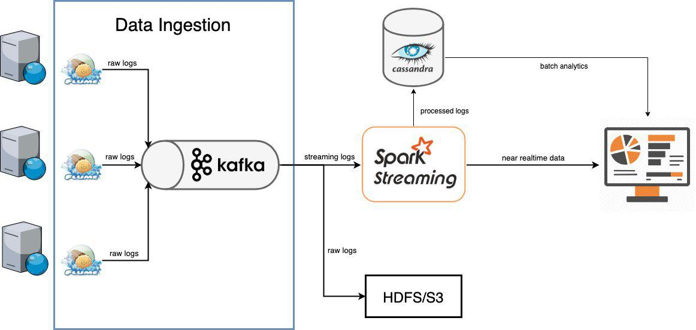
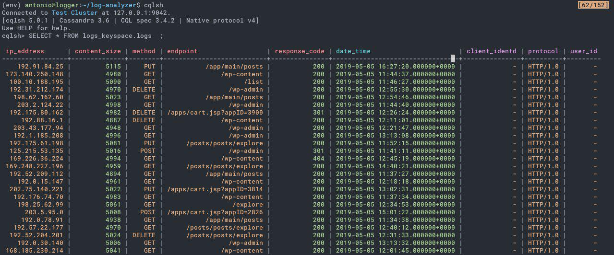
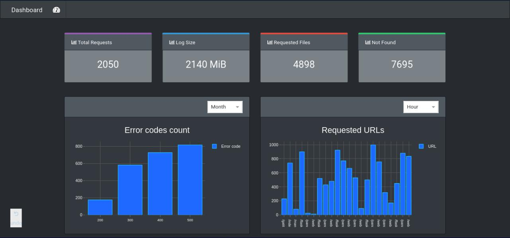

# Un problema a solucionar...

A lo largo de esta asignatura hemos visto como desplegar servidores web de altas
prestaciones. El concepto que hace eco en nuestra cabeza seguramente sea "granja
web". Tras usar esta técnica, una de las cuestiones a solucionar es: ¿cómo
recopilo información de mi granja? A estas alturas es muy probable que todos
tengamos claro que es un log y la importancia que tiene (si no es así, tranquilo,
en el siguiente punto daremos un repaso para los más rezagados). Cuando tenemos
un solo servidor, simplemente consultamos un único archivo que genera Apache
HTTP, Nginx, [inserte aquí su servidor web]... para ver los logs pero, ¿y si
nuestra granja web esta compuesta por 10 servidores finales?¿Y si son 100? Esto
rápidamente se nos va de las manos...

En esta memoria os presentaremos la solución que hemos dado nosotros y cómo lo
hemos implementado. Obviamente hay muchas otras maneras de hacerlo y os
invitamos a que investigueis al respecto.

# ¿Que es Log Analysis?

Cuando un programa está ejecutándose (este puede ser un servidor web, el propio
sistema operativo...) pasan cosas constantemente (clientes abriendo la página
web, inicios de sesión, crear un nuevo archivo...). Llamaremos a esto eventos.
Estos eventos se almacenan en unos archivos que reciben el nombre de "archivos de
log".

En los archivos de log, como ya hemos dicho, podemos encontrar un registro de
los eventos que han sucedido en ciertos programas (obviamente cada programa
tiene su propio archivo, si no esto sería un caos, aunque hay maneras de
consultar todos los logs del sistema de manera simultanea). En el caso que nos
interesa a nosotros, los servidores web, veremos información de las peticiones
HTTP que han realizado los diferentes clientes. Obtendremos información como la
IP desde la que el cliente se conecta, qué parte de la web ha solicitado, el
código de error que ha devuelto nuestro servidor (2xx, 3xx, 5xx...), a qué hora
realizó la petición, el protocolo usado...

Toda esta información no viene dada en un formato estructurado como por ejemplo
JSON, sino que es una línea de información que siempre muestra los mismo campos
en el mismo órden y que nosotros deberemos ir extrayendo mediante parsing (Regex
por ejemplo). A este tipo de datos se les llaman datos semiestructurados.

# Importancia

Analizar los logs es súmamente importante. En la informática, como su propio
nombre indica, la información es lo más importante. Cuando más información
tengamos de cómo está funcionando nuestro servidor web, más podremos prevenir
los futuros problemas. Por ejemplo, si vamos analizando los logs de nuestro
servidor en tiempo real, al fin y al cabo estamos monitorizándolo. Podemos poner
diferentes alertas, por ejemplo si un mismo cliente (misma IP) está intentando
entrar a ciertas rutas que no paran de devolver un código 4xx (aquí se incluyen
peticiones que resultan páginas prohibidas, que requieren autenticación...) y
actuar al respecto, por ejemplo baneando dicha IP (prohibiendo que vuelva a
conectarse más a nuestro servidor) o seguirle de cerca para tratar de averiguar
quién es o qué quiere.

# Problemas con el análisis en tiempo real

Lo que buscamos entonces es poder analizar estos logs en tiempo real para poder
monitorizar bien nuestra granja. Para explicar bien esto introduciremos dos
términos: cauce y latencia. Cauce es la cantidad de datos que procesas por
unidad de tiempo. Latencia es el tiempo que tardas en procesar un log. Debemos
de mantener un equilibrio entre estos términos a la hora de analizar nuestros
datos. No tiene sentido ir procesando los logs cada segundo, ya que si no hay
muchos clientes, iremos procesando los logs de uno en uno o ninguno; tampoco
tiene sentido esperar a tener en cola 100 logs para entonces procesarlos, ya que
quizás esperaremos demasiado y perderemos el "tiempo real".

# Nuestra solución

Utilizaremos este punto para introducir nuestra solución. En primer lugar,
dividiremos este problema en varias partes:

-   Ingestión.
La ingestión es el momento en el que cogemos los datos, los logs, y los movemos
al servidor donde se procesarán. Para esto utilizaremos [Apache
Flume](https://flume.apache.org/) y [Apache
Kafka](https://kafka.apache.org/). (No, Apache no patrocina esta memoria)

-   Procesamiento.
El procesamiento es el momento en el que tomamos los logs en crudo, tal y como
los produce nuestro servidor web, y obtenemos la información que nos interesa de
los eventos. Para esto utilizaremos [Apache Spark](https://spark.apache.org/),
[Apache Cassandra](https://cassandra.apache.org/) y [Apache
Hadoop](https://hadoop.apache.org/) (HDFS).

-   Presentación de la información.
El visionado es el momento en el que se muestra la distinta información, ya
digerida, en un panel para que puedan consultarse. Aquí pueden consultarse
diferentes relaciones entre los eventos como el número total de visitantes, los
diferentes códigos de error devueltos... Para esto utilizaremos 
[Dash (by Plotly)](https://plot.ly/products/dash/).

Vamos a comentar un poco por qué hemos usado este software y no otro:

En el caso de Kafka, cuenta con una interfaz genérica con todas las fuentes de
información. Spark tiene una integración perfecta con Kafka y podemos conectarla
directamente con HDFS. Además la paralelización es la base de su desarrollo. En
cuanto a Flume, se conecta bien con Kafka y además permite muchas fuentes
distintas (más adelante veremos esto).

Todas estas herramientas están pensadas para el BigData, por lo que escala tan
bien como una granja web. Además todo es de Apache, por lo que el hecho de que
se integre bien no es ninguna sorpresa.

No obstante, cabe mencionar que todos las partes son reemplazables. Kafka podría
reemplazarse por RabbitMQ, Spark por Storm (o tu propia implementación)...
Aunque tal y como lo hemos hecho todo funciona bien, casi de manera automática.
Cassandra podríamos sustituirlo por HBase o cualquier base de datos NoSQL.
El panel también podría cambiarse por implementaciones
[InfluxDB](https://www.influxdata.com/products/influxdb-overview/), que aunque
te facilita mucho el desarrollo, hace que pierdas cierta flexibilidad.

## Arquitectura y diseño

Una vez que tenemos una idea aproximada de cual será el flujo de datos, lo
aclararemos con una imagen. Como vemos en la Figura 1, en pocas palabras nuestro
diseño hará lo siguiente: 

-   Un agente de Flume (instalado en cada uno de los servidores finales) enviará
    los logs a Kafka.
-   Spark tomará la información que recibe Kafka y la irá almacenando en crudo
    en HDFS. También procesará esta información, estructurándola y almacenándola
    en una base de datos Cassandra.
-   El Dashboard irá tomando la información de Cassandra para presentar
    diferentes datos que nos interesan.

Ahora veremos qué hace exactamente cada programa y como nos permite realizar
esto.

-   Apache Flume. Servicio que nos permite coger, agregar y mover grandes
    cantidades de logs de manera eficiente. Tiene una arquitectura simple basada
    flujo de datos. En la Figura 2 podemos ver como funciona:
    Un agente toma la información de una fuente (por ejemplo leer un archivo), la
    mueve mediante un canal (por ejemplo la memoria principal) y lo deposita en una
    pila (por ejemplo otro servicio como Kafka).

-   Apache Kafka. Plataforma de streaming distribuido. La idea básica es que
    tenemos canales, llamados "topics", por donde fluirá la información. Hay dos
    tipos de usuarios, los productores (en nuestro caso los agentes Flume) que
    enviarán la información y los consumidores que serán los que tomarán esa
    información. Además tiene particiones, lo cual da paralelismo tanto a los
    consumidores como a los productores sobre el mismo topic.

-   Apache Spark. Framework open-source que permite hacer cómputo en clusters,
    en nuestro caso para procesar logs de manera rápida y eficiente.

-   Apache Cassandra. Sistema de almacenamiento de bases de datos NoSQL. Permite
    manejar grandes cantidades de datos de manera eficiente y escalable. Lo
    utilizaremos para almacenar la información ya procesada, para luego ser
    mostrada a nuestra voluntad en el panel.

-   Apache Hadoop. Colección de herramientas que facilita el manejo de grandes
    cantidades de datos. Nosotros más concretamente proponemos HDFS, que es un
    sistema de ficheros distribuidos basado en Java para almacenar grandes
    cantidades de datos. Esto es esencial en entornos de producción donde es
    necesario almacenar los logs en crudo, sin procesar.

-   Dash by Plotly. Framework escrito en Python que nos permite de manera
    sencilla y elegante desarrollar aplicación web para analisis. Es así como
    presentamos los datos una vez han sido procesados.

## Implementación

Hablar sobre la configuración de los clusters, agentes, y base de datos.
Hablar del consumo de datos por parte del Dashboard (peticiones a cassandra
y consumo de Kafka).

Para implementar esta arquitectura y el diseño que mostramos en la Figura 1, lo
primero que hemos hecho es aprovisionarnos de servidores. Hemos utilizado los
VPS (Virtual Private Server) de [DigitalOcean](https://www.digitalocean.com/).
Hemos elegido este proveedor porque cuenta con un plan de referidos en el que a
nuevos clientes les dan 100 euros para gastar en servidores, por lo que podremos
hacernos con un buen arsenal:

-   4 x Servidores web básicos finales. Aquí tendremos corriendo el agente de
    Flume y [un generador de
    logs](https://github.com/kiritbasu/Fake-Apache-Log-Generator) que simulará gran
    cantidad de tráfico.
-   1 x Servidor para procesar toda la información. Se trata de un servidor más
    potente (4 nucleos). Es por eso que hemos escogido usar 4 servidores web
    finales, para aprovechar al máximo el paralelismo. Aquí estará Kafka, Spark,
    Cassandra y el Dashboard. En nuestro ejemplo no instalaremos HDFS por
    motivos de espacio. En un entorno de real cada uno de estos servicios
    correría en servidores diferentes y sería obligatorio, como ya comentamos
    anteriormente, el uso de HDFS para almacenar los logs en crudo.

Para llevar a cabo la instalación, comenzaremos por configurar los servidores
web (aquí lo explicaremos de manera muy general, cada uno luego podrá consultar
de manera más específica lo que tenga dudas viendo [el
repositorio](https://github.com/antoniomdk/log-analyzer/)). Para ello
pondremos primero a generar los logs de manera automática. Una vez que se están
generando, debemos instalar Apache Flume (que lamentablemente no está en los
repositorios, tendremos que descargar el código fuente e instalarlo nosotros
mismos). Una vez instalado y configurado para que envíe los logs a nuestro
servidor de procesamiento, lo dejaremos a la espera de ejecutar (primero debemos
instalar y configurar Kafka).

Cuando ya tenemos todos los servidores web preparados, nos vamos al servidor de
procesamiento. Aquí en primer lugar instalaremos Apache ZooKeeper para
facilitarnos la instalación. Una vez hecho esto, simplemente iniciaremos el
servicio. Es turno de instalar Apache Kafka. Todos estos servicios, al igual que
Flume, no están en el repositorio sino que debemos descargarlo de la web de
Apache. Tras instalarlo, debemos crear los topics por donde fluirá la
información (en nuestro caso dos, uno para Flume y otro para el Dashboard).

Una vez hecho esto, ya podemos iniciar Flume en los servidores web y veremos
como empiezan a llegar los logs (se crea un archivo en /tmp). Como dato curioso,
habia que añadir el hostname del servidor de procesamiento en el */etc/hosts* de
cada uno de los servidores web, aún no sabemos muy bien por qué.

Ha llegado el momento de procesar la información. Para ello en primer lugar
instalaremos Cassandra, ya que será en una de sus bases de datos donde iremos
guardando esta información. Para ello primero añadiremos el repositorio donde se
encuentra para poder instalarlo con APT. Ejecutamos el servicio y ya podemos
crear nuestra tabla. Para ello debemos crear un *key space* que será nuestro
espacio de trabajo para cada tabla.

Cuando ya tenemos listo nuestro almacenamiento, debemos procesar la información.
Para ello usaremos Spark, que se conectará a Kafka para recibir los batches
(entradas de log) y procesarlos de forma paralela. Cada CPU tiene su conexión a
la base de datos Cassandra para poder ir añadiendo entradas a la tabla de forma
paralela. En la Figura 3 podemos ver un ejemplo de como se nos queda la tabla.
En la Figura 4, podemos ver en tiempo real como Spark va recibiendo y procesando
los diferentes batches.

Llegó el momento de presentar la información. Para ello implementaremos un panel
sobre Dash. Cuando se genera una acción sobre el Dashboard, se
genera la petición sobre la base de datos para obtener la información que se ha
pedido. Tiene una parte de tiempo real en la que el panel obtiene los datos
directamente de Spark que están en cola en Kafka, lo que nos permite ver todo en
tiempo real en un intervalo de 5 a 10 segundos. En la Figura 5 podemos ver como
nos ha quedado nuestro panel.

